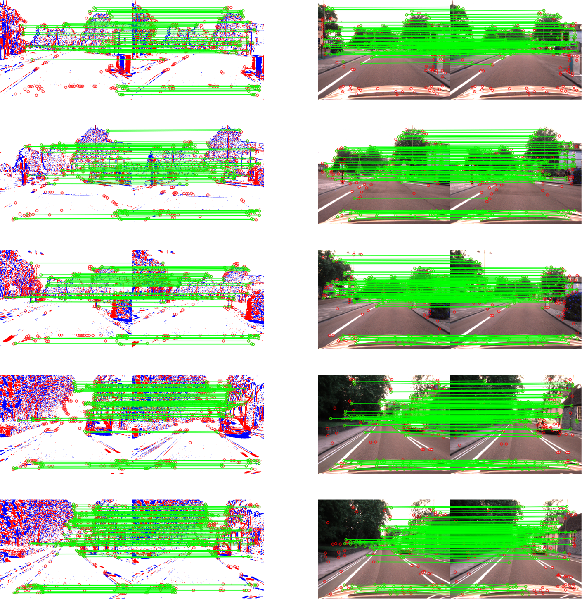
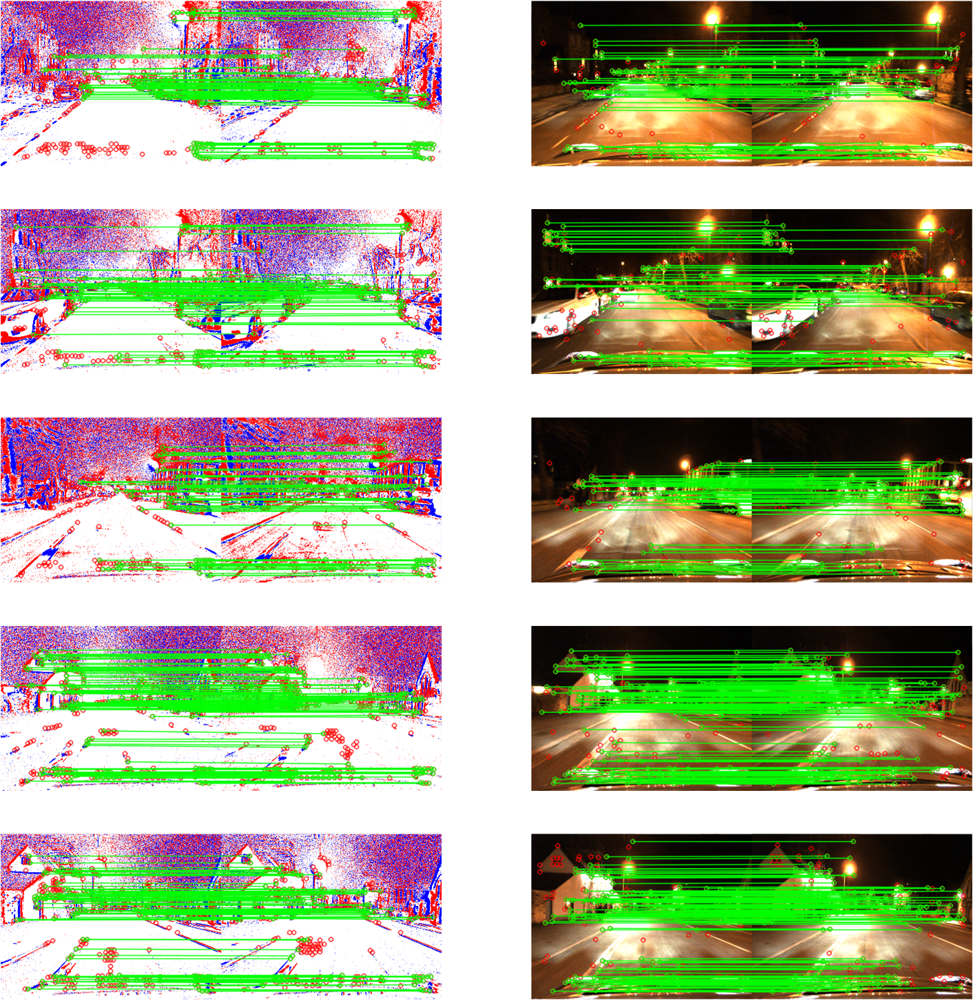

# Double Net Distillation
This project is the graduation project of Shuming Zhang(Samuel), Department of Computer Science, University of Sheffield. This is a model of knowledge distillation to extract key points and descriptors from event images.  
 ## Dataset
The RGB image set and Ground Truth comes from [Oxford Robotcar Dataset](https://robotcar-dataset.robots.ox.ac.uk),you can find a lot useful tool from [robotcar-dataset-sdk](https://github.com/ori-mrg/robotcar-dataset-sdk) moreover two related papers ["1 Year, 1000km: The Oxford RobotCar Dataset"](https://robotcar-dataset.robots.ox.ac.uk/images/robotcar_ijrr.pdf) and ["Real-time Kinematic Ground Truth for the Oxford RobotCar Dataset"](https://robotcar-dataset.robots.ox.ac.uk/images/RCD_RTK.pdf) can also be found in this repository.  
## Event camera simulator
In this project, we generate event images by using [ESIM_torch](https://github.com/uzh-rpg/rpg_vid2e) and RGB pictures.The paper can be found [here](http://rpg.ifi.uzh.ch/docs/CVPR20_Gehrig.pdf).  
If you use this code in an academic context, please cite the following work:
```shell
@InProceedings{Gehrig_2020_CVPR,
  author = {Daniel Gehrig and Mathias Gehrig and Javier Hidalgo-Carri\'o and Davide Scaramuzza},
  title = {Video to Events: Recycling Video Datasets for Event Cameras},
  booktitle = {{IEEE} Conf. Comput. Vis. Pattern Recog. (CVPR)},
  month = {June},
  year = {2020}
}
````
Daniel Gehrig, Mathias Gehrig, Javier Hidalgo-Carrió, Davide Scaramuzza, "Video to Events: Recycling Video Datasets for Event Cameras", The Conference on Computer Vision and Pattern Recognition (CVPR), 2020
 ## Teacher network
The teacher network required for knowledge distillation comes from [SuperPoint](http://cocodataset.org/#download) which is a Tensorflow implementation of  "SuperPoint: Self-Supervised Interest Point Detection and Description." Daniel DeTone, Tomasz Malisiewicz, Andrew Rabinovich. [ArXiv 2018](https://arxiv.org/abs/1712.07629).

## Installation

```shell
make install  # install the Python requirements and setup the paths
```
## Usage
All commands should be executed within the `Double_Net_Distillation/` subfolder. When training a model or exporting its predictions, you will often have to change the relevant configuration file in `Double_Net_Distillation/config/`.

### 1) Set training path
You can set the path required for training in `setting.py`.
```shell
RGB_PATH ='your RGB images path'
EVENT_PATH = 'your event images path'
WEIGHT_PATH = 'your SuperPoint pretrained model path'
TENBOARD_PATH = 'your tensorboard save path(if you use)'
```
### 2) Train student netowrk
You can set detailed training parameters in `config`, including the number of iterations, batch size, etc. Then run:
```shell
python distillation.py config/train_event_32x64_sp_v6.yaml
```
### 3) Set evaluation path
You can set the path required for evaluation in `evaluation/evaluation_setting.py`.
```shell
INS_PATH = 'your ins/gps.csv file path(get it from  Oxford Robotcar Dataset)'
TP_PATH = 'your timestamps file(get it from  Oxford Robotcar Dataset)'
RGB_PATH ='your RGB images path'
EVENT_PATH = 'your event images path'
SP_weights_dir = 'your SuperPoint pretrained model path'
DND_weights_dir = 'your SuperPoint pretrained model path'
```
### 4) Evaluation
Run:
```shell
python evaluation/evaluations.py config/train_event_32x64_sp_v6.yaml
```
Note that you can also pass in additional arguments such as `--H`, `--W`, `--k_best` to specify the height and width to resize the images.
### 5) (extra)Demonstration
With the pretrained weights extracted, you can run the match_features_demo.py to compare SuperPoint and Double Net Distillation matches across two images:
```shell
python match_features_demo.py SP_path(or DND_path) RGB_image1 RGB_image2 event_image1 event_image2
```
The results shown are as follows:


